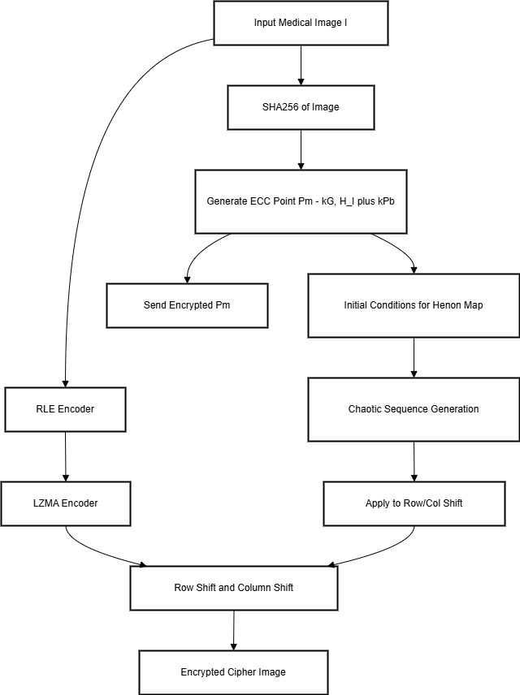
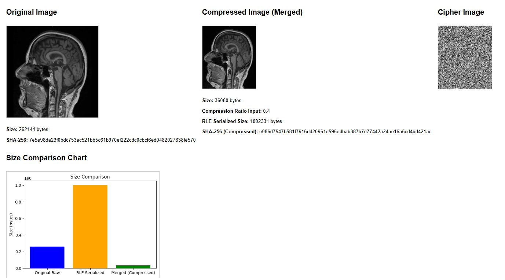
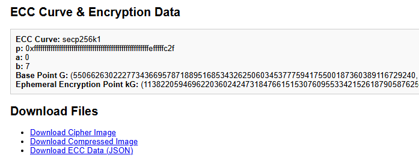

# Hybrid-Medical-Image-Analysis
Hybrid Medical Image Analysis is a secure processing and transmission system for high-resolution medical images. It employs LZMA lossless compression to minimize file sizes and ECC-based encryption along with chaotic Henon map shifts to secure sensitive information, guaranteeing integrity for diagnostic purposes in smart healthcare.


Medical imaging plays a vital role in diagnosis and treatment planning. However, the high resolution and sensitive nature of these images pose significant challenges with respect to data security, storage, and efficient transmission. Our project presents a secure image processing system that integrates advanced compression using the Lempel-Ziv-Markov Chain Algorithm (LZMA) and robust encryption techniques (using ECC-based key generation and chaotic Henon map shifts).


## System Architecture Overview

The system consists of two major parts:
1. **Secure Image Processing:** This part covers the entire processing pipeline from pre-processing to encryption/decryption.
2. **Compression and Encryption Statistics:** Visual statistics that demonstrate the effectiveness of the compression and encryption stages.

Below is a high-level overview of the system architecture:




## Detailed Process Description

### 1. Pre-Processing and Duplicate Removal
**Objective:**  
Reduce redundancy by removing duplicate rows and columns in the image.

**Process Steps:**
- **Duplicate Removal:**  
  Identify and remove rows and columns that have identical pixel values to form a deduplicated image.
  

- **Run-Length Encoding (RLE):**  
  Apply RLE to encode consecutive pixel values as pairs \((p, c)\), where \(p\) is the pixel value and \(c\) is its count.
  
### 2. LZMA Compression
**Objective:**  
Apply lossless compression using LZMA to significantly reduce the file size while maintaining all critical image data.

**Key Details:**
- **Dictionary-Based Modeling:**  
  The algorithm identifies recurring substrings within \(I_{\text{RLE}}\) and replaces them with references \((p, l)\), where \(p\) is the dictionary index and \(l\) is the length.
  
- **Markov Chain and Range Coding:**  
  It estimates \(P(c|C)\) for a symbol \(c\) with context \(C\) using a Markov model, then encodes the data via range coding. 


**Compression Stats:**  
Below is an image showing compression statistics.




### 3. Encryption Using ECC and Chaotic Henon Map Shifts
**Objective:**  
Secure the compressed image using a combination of ECC-based key generation, XOR encryption, and chaotic pixel shifts based on the Henon map.

**Encryption Process Steps:**
1. **SHA-256 Hashing:**  
   Compute the hash of the original image:

2. **ECC-Based Key Generation:**  
   On an elliptic curve (e.g., secp256k1 with parameters \((p, a, b, G)\)):
   - Select a random ephemeral private key \(k\).
   - Compute the corresponding public key:
  
   
3. **XOR Encryption:**  
   Seed a pseudorandom number generator (PRNG) with \(Y\) (or a derived value) to generate a keystream, then XOR the compressed image with this keystream:

   
4. **Henon Map-Based Row/Column Shifts:**  
   Use the Henon map and derive shift values:
   Apply these shifts to the XORed image to obtain the cipher image:
   
**Encryption Stats:**  
Below is an image showing encryption statistics.




### 4. Decryption Process
**Objective:**  
Reverse the encryption process to recover the original compressed image, and then reconstruct the original image.

**Decryption Steps:**
1. **Inverse Henon Map Shifts:**  
   Recompute the Henon map shift values with the same parameters and apply the inverse shift:
   
2. **XOR Decryption:**  
   Reinitialize the PRNG using the same seed derived from \(kG\) and XOR the image again to recover the compressed image:
   
3. **LZMA Decompression:**  
   Decompress \(I_{\text{comp}}\) using LZMA:

   
4. **RLE Decoding:**  
   Reconstruct the original image by decoding the RLE data:
   
   
5. **Integrity Verification (Optional):**  
   Compute the hash of the recovered image and verify it against \(H_I\):


## How to Use

Follow these steps to encrypt and decrypt an image:

1. **Run Encryption:**
   - Place your original image (e.g., `input_image.jpg`) in the project directory or specify its path.
   - Run the encryption script by executing the following command in your terminal:
     
     ```bash
     python encryption.py --image path/to/input_image.jpg
     ```
     
   - After the script completes, you will receive two outputs:
     - **Cipher Image:** The encrypted image (e.g., `cipher_image.png`).
     - **ECC JSON Data:** A JSON file (e.g., `ecc_data.json`) containing ECC-related key data required for decryption.

2. **Upload/Download (if applicable):**
   - If your workflow requires, upload the cipher image and ECC JSON data to the designated location.
   - Download them as needed for the decryption process.

3. **Run Decryption:**
   - Using the cipher image and the ECC JSON data from the encryption step, run the decryption script:
     
     ```bash
     python decryption.py --cipher path/to/cipher_image.png --key path/to/ecc_data.json
     ```
     
   - The script will reverse the encryption process and output the decrypted image (e.g., `decrypted_image.png`), which should match your original image.

## Libraries and Dependencies

This project uses the following libraries and tools:

- **Python 3.x:** The programming language for the project.
- **lzma:** Python's built-in library for LZMA compression and decompression.
- **hashlib:** For computing SHA-256 hashes to ensure data integrity.
- **Pillow (PIL):** For image reading, manipulation, and saving.
- **JSON:** For handling ECC key data in a structured format (part of Python's standard library).
- **NumPy:** (optional) For numerical operations if required by the image processing modules.
- **Custom Implementations:** Algorithms for RLE,ECC,Henon map calculation, and custom shift operations.


